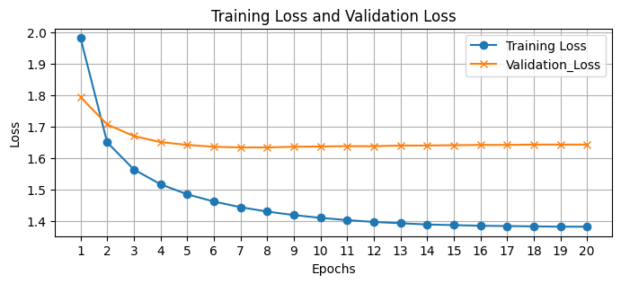
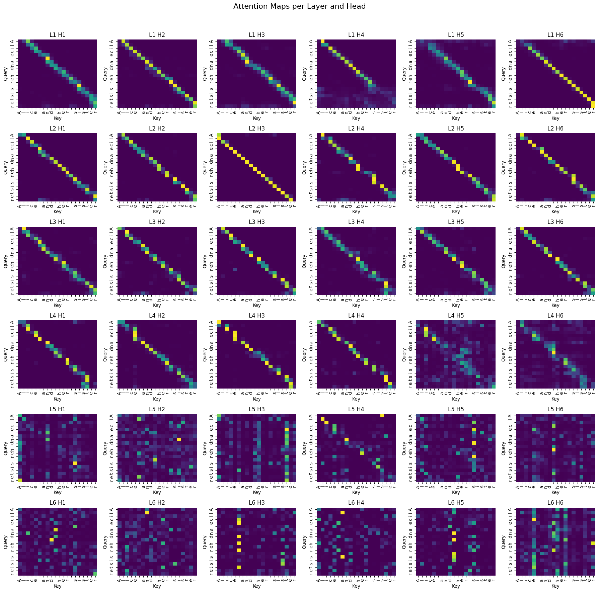
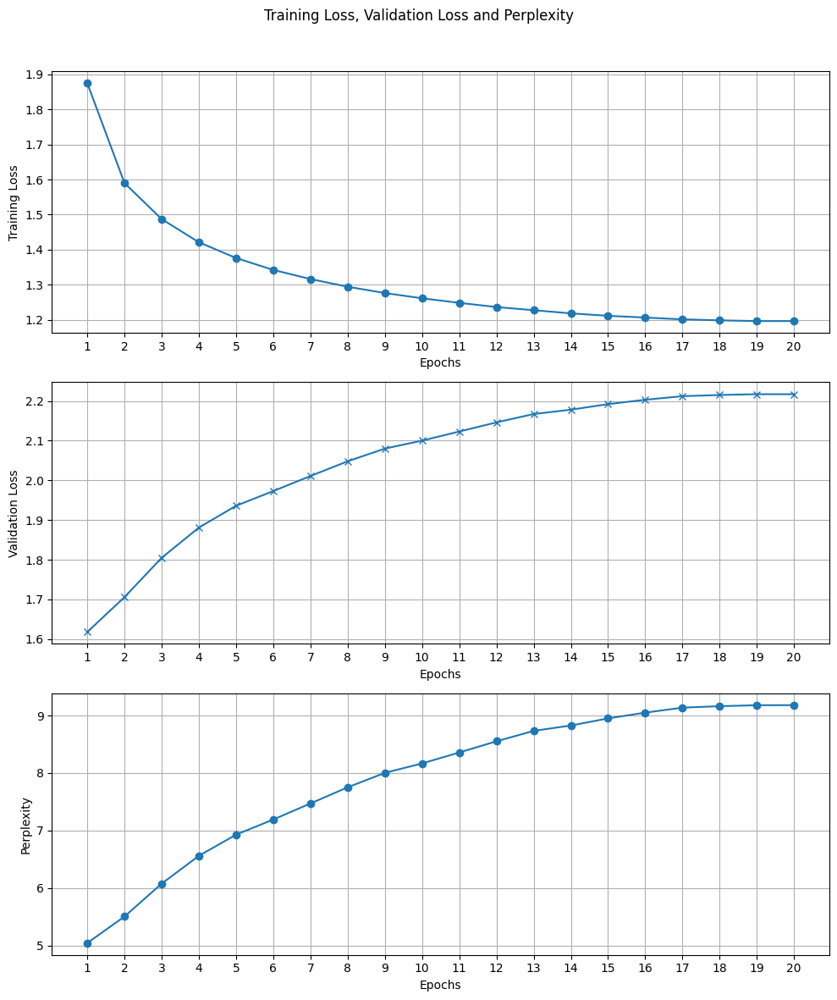
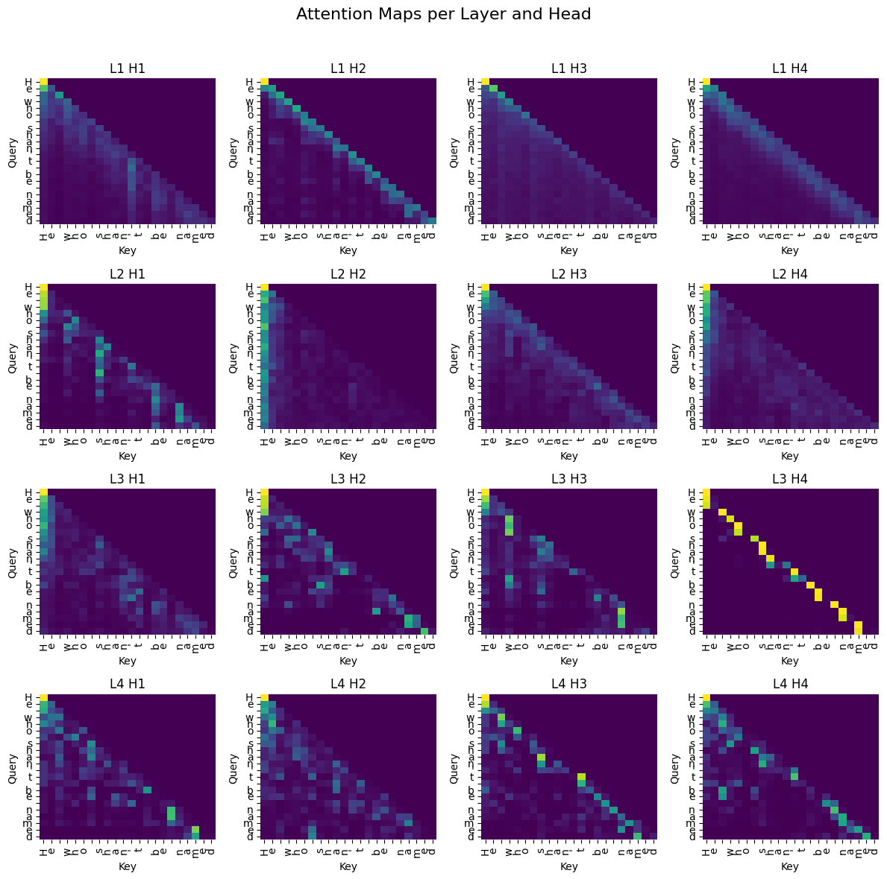
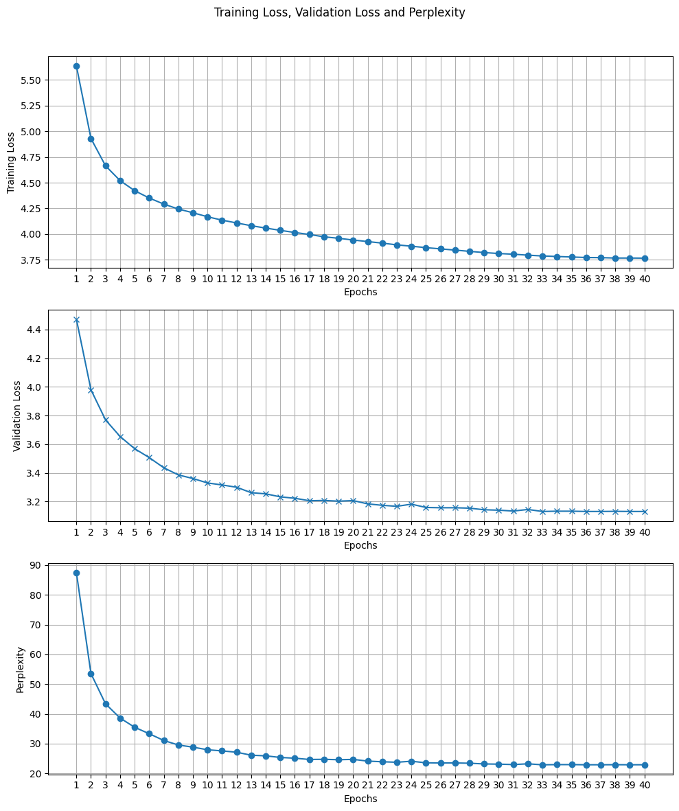
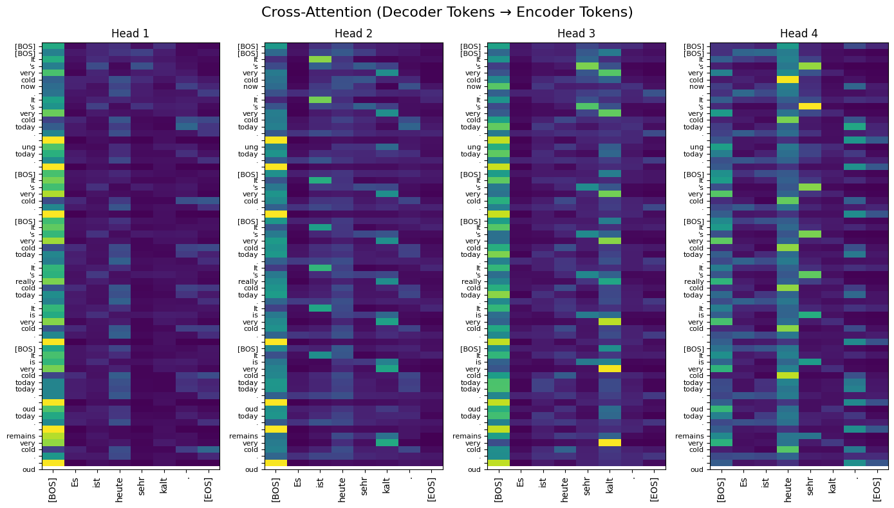

# 📌 Overview
This project explores the architecture, training, and inference of large language models from scratch using PyTorch. It also revisits the LSTM architecture from the pre-transformer era to provide historical and performance-based comparison.

The following model types are implemented and analyzed:

* Encoder-only Transformers (e.g., BERT-style)

* Decoder-only Transformers (e.g., GPT-style)

* Full Seq2Seq Transformers (e.g., for machine translation)

* Baseline RNN model using LSTM

# 📚 Datasets Used
All datasets used in this project are stored in the `data/` folder.
To evaluate and compare various model architectures, the following datasets were employed:

1. Tiny Shakespeare
    - Size: ~1MB of text.
    - Use Case: Useful for quick experimentation with character-level generation due to its small size and stylistic consistency.
    - Applied in: Encoder-only, decoder-only, and LSTM models.

2. Alice in Wonderland by Lewis Carroll
    - Size: ~150KB of text.
    - Use Case: Classic English literature offering structured narrative text, used for experimenting with character-level and word-level tokenizations owing to its small vocabulary size.
    - Applied in: Encoder-only, decoder-only, and LSTM models.

3. IWSLT2017 (EN↔DE Translation)
    - Size: ~40MB of ~200K sentence pairs.
    - Type: Parallel English-German corpus
    - Use Case: Designed for benchmarking machine translation models.
    - Applied in: Seq2Seq Transformer with shared Byte-Pair Encoding (BPE) tokenizer.

# 🧩 Tokenization Strategies
Tokenization plays a crucial role in how language models process and understand text. This project experiments with multiple tokenization schemes to analyze their effect on model performance and generalization.

1. Character-Level Tokenizer
    - Type: Custom, from-scratch implementation -> `utils/ch_tokenizer.py`.
    - Vocabulary: All unique characters from the dataset.
    - Pros: Simple to implement and captures fine-grained detail.
    - Cons: Longer sequences and lower convergence due to sparse signal.

2. Word-Level Tokenizer (Custom)
    - Type: Custom tokenizer splitting on whitespace and punctuation -> `utils/word_tokeinizer.py`
    - Vocabulary: Built manually from training corpus.
    - Pros: More semantic understanding than character-level and faster convergence.
    - Cons: Vocabulary explosion with rare or compound words and poor generalization to unseen words.

3. Byte-Pair Encoding (BPE)
    - Type: Subword-level tokenizer using HuggingFace's tokenizers library.
    - Shared Vocabulary: Trained on combined English-German corpus from IWSLT2017.
    - Training script `scripts/train_tokenizer_seq2seq.py`.
    - Trained tokenizer `tokenizers/seq2seq_shared_tokenizer.json`.
    - Pros: Handles rare words and morphology gracefully, vocabulary size can be tuned and suitable for multilingual tasks.
    - Cons: Slightly more complex setup.

# 📦 Dataset Classes
Custom PyTorch `Dataset` classes were implemented to efficiently handle training samples for different model-tokenizer combinations.

1. `TextDataset` – for Character/Word Tokenizers
    - Used with: Character-level and word-level tokenizers.
    - Purpose: Prepares fixed-length input (x) and target (y) sequences for next-token prediction.
    - Mechanism: For each sample, `x = tokens[i : i+seq_len], y = tokens[i+1 : i+1+seq_len]`
    - Output: (x, y) as integer token sequences.

2. `Seq2SeqDataset` – for BPE-based Translation
    - Used with: BPE tokenizer (`seq2seq_shared_tokenizer.json`)
    - Purpose: Prepares padded input-output sentence pairs for Seq2Seq translation tasks.
    - Mechanism: Tokenizes and pads both `src` and `tgt` sequences and generatesencoder input, decoder input with `[BOS]` and decoder target (right shifted).
    - Output: Dictionary with `src`, `tgt`, and `label` tensors.

# 📍 Positional Embeddings
Since transformer models process input sequences in parallel rather than sequentially (like RNNs), they require a mechanism to inject information about token order — this is where positional embeddings come in.

Positional embeddings are added to the input token embeddings to help the model understand the relative or absolute position of each token in a sequence. Without them, the model would treat the input as a bag of words, losing all information about syntax or structure.

This project implements two types of positional embeddings:

1. Fixed (Sinusoidal) Positional Encoding
    - Based on the formulation from the original Transformer paper (Vaswani et al., 2017).
    - Uses sine and cosine functions of different frequencies.
    - Non-trainable and consistent across all inputs.
    - Implemented in: `models/encoder_only/fixed_positional_encoding.py`

2. Learnable Positional Encoding
    - A trainable embedding matrix added to the token embeddings.
    - Learns position representations specific to the dataset/task.
    - Implemented in: `models/encoder_only/learnable_positional_encoding.py`

All encoder-only, decoder-only, and seq2seq training scripts include a use_sinusoidal boolean flag that can be toggled to switch between fixed and learnable positional encodings.

```
if use_sinusoidal:
    self.pe = SinusoidalPositionalEncoding(seq_len, embed_dim)
else:
    self.pe = LearnablePositionalEncoding(seq_len, embed_dim)
```

# 🧠 LSTM Model (Pre-Transformer Baseline)
The baseline recurrent architecture is implemented in `models/lstm/rnn_LSTM.py`, with training handled via `train_lstm.py` and configurations specified in `config_lstm.py`. Inference or generation from trained checkpoints can be tested using the `generator/lstm_generator.py` script.

Initial experiments were conducted using the Alice in Wonderland dataset with a character-level tokenizer. Without any learning rate scheduling or regularization, signs of overfitting began as early as the first or second epoch. Particularly, when seed prompts were taken directly from the dataset, the generated outputs reproduced the training text almost verbatim. Even when the seed was a random phrase, the generation quickly collapsed into sequences memorized from the dataset, highlighting a severe lack of generalization.

To mitigate this, a lower learning rate and a cosine annealing scheduler were introduced. With this adjusted configuration, the training and validation losses began to diverge only after 7–8 epochs, showing a more realistic training pattern before overfitting set in. A sample loss curve is included in the notebook and visualized below:

The same LSTM model was also tested with a word-level tokenizer trained on the same dataset. Although it showed faster convergence, the generalization issues remained, particularly when the vocabulary was large or rarely occurring tokens were frequent.

<p align="center">
  
</p>

# 🧠 Encoder-Only Transformer (BERT-style)
This model is based purely on a stack of self-attention-based encoder blocks and is implemented in `models/encoder_only/encoder_only_transformer.py`. The training logic resides in `train_encoder_only.py`, with hyperparameters defined in `config_encoder_only.py`. Generation from trained checkpoints can be tested using `generator/encoder_only_generator.py`.

Unlike LSTM models that process inputs sequentially, encoder-only transformers operate on the entire input sequence in parallel. Each token is embedded and enriched with positional encodings, then passed through multiple layers of multi-head self-attention and feedforward blocks. The attention mechanism allows each token to focus on other relevant tokens in the sequence, enabling the model to learn dependencies and semantic relationships irrespective of their positions. Below is a schematic of the encoder-only transformer architecture. One small difference in the implementation is the use of layer-norm blocks before the attention block and the feedforward block and not after. After the stack of encoders one fully connected layer was added to map into the dimension of vocab_size, which finally generates the logits.

<p align="center">
  
</p>

The self-attention block plays a crucial role here: it helps the model decide "where to look" when processing a token. By splitting into multiple attention heads, the model can learn various types of relationships (e.g., syntactic vs. semantic) simultaneously across different subspaces. These are later merged and passed through residual and feedforward layers to form rich contextual embeddings for each token.

Training behavior was stable and showed no signs of overfitting in early experiments. Around epoch 15 the validation loss was the lowest, then it showed an overfitting tendency. A typical training vs. validation loss curve is shown below. Also shown is the perplexity. Lower the value, more the model is confident towards some specific tokens for prediction.

<p align="center">
  
</p>

In the earlier layers, attention heads exhibit strong diagonals — a clear indication that the model is primarily attending to each token itself or immediate neighbors. This behavior is expected in early stages, as the model hasn't yet learned meaningful contextual relationships and defaults to identity-like attention for stability. However, in the deeper layers, the attention becomes noticeably more diffuse and asymmetric. The diagonals weaken, and we begin to see off-diagonal activations that reflect the model's growing ability to attend to semantically or syntactically relevant tokens elsewhere in the sequence.

<p align="center">
  
</p>

The visualized attention heads in Layer 6, for instance, show non-trivial attention to non-adjacent tokens, suggesting the model has learned to selectively emphasize information beyond immediate token neighbors

When it comes to generalization, the encoder-only model outperformed LSTMs. On both datasets (Tiny Shakespeare and Alice in Wonderland), the generated sequences retained the stylistic flavor of the original corpus — such as sentence structure and vocabulary — but without directly copying specific sequences. This contrasts sharply with LSTMs, where outputs often became memorized reproductions of the training text, especially when seeded with familiar phrases. The transformer-based model demonstrated more creative recombination of learned patterns, indicating a better understanding of underlying language semantics rather than simple memorization.

# 🧠 Decoder-Only Transformer (GPT-style)
The decoder-only transformer model is implemented in `models/decoder_only/decoder_only_transformer.py`. The training logic is handled by `train_decoder_only.py`, with configuration defined in `config_decoder_only.py`. Text generation is carried out using `generator/decoder_only_generator.py`.

This architecture is based solely on decoder blocks, each containing masked multi-head self-attention followed by feedforward layers and residual connections. Unlike encoder-only models that process the full sequence in parallel, the decoder-only model predicts the next token given only the previous ones, making it inherently autoregressive and suitable for generation tasks.

<p align="center">
  
</p>

A key component of the decoder block is masked attention. During training, each token can only attend to earlier tokens in the sequence, preventing it from "seeing the future." This is achieved through an upper triangular attention mask that zeros out the upper diagonal of the attention matrix — as clearly visible in the attention heatmaps below. Each attention head learns different aspects of context from previously seen tokens, and the masking enforces strict causal flow from left to right.

Despite its simplicity in concept, the decoder-only transformer proved to be the most difficult to train. Initial experiments without learning rate scheduling led to exploding validation losses and unstable convergence. After careful tuning of the learning rate and integrating a cosine annealing scheduler, the training stabilized — though validation loss still plateaus after several epochs. This is visualized in the following training curve:

<p align="center">
  
</p>

And the multi-head attention heatmaps from a trained model demonstrate how each head focuses progressively on past tokens while strictly avoiding future positions (upper triangle):

<p align="center">
  
</p>


This model generalizes decently, and generated sequences reflect the training data’s language style — but still show occasional instability or repetition in longer generations, especially if trained too long or on a small dataset.

# 🔁 Seq2Seq Transformer (Encoder–Decoder Architecture)
This architecture is modeled after the original Transformer design proposed in the Vaswani et al., 2017 paper (“Attention is All You Need”). It uses both an encoder and a decoder stack to perform sequence-to-sequence tasks such as language translation. The encoder processes the full input sentence (in German), and the decoder auto-regressively generates the translated output sentence (in English), one token at a time.

📍Task Overview:
The model is trained to perform German-to-English translation using the IWSLT2017 EN↔DE dataset. Tokenization is handled by a Byte-Pair Encoding (BPE) tokenizer trained on the joint corpus of English and German text using HuggingFace’s tokenizers library. The tokenizer captures subword units, which helps in reducing vocabulary size while still generalizing well to rare words.

🧠 Architecture Summary:
  - The encoder takes the full German sentence and outputs contextual embeddings.
  - The decoder receives a [BOS] token followed by previously generated tokens and attends to both:
    - Itself (via masked self-attention to prevent peeking at future tokens).
    - The encoder’s outputs (via cross-attention).
  - The training objective is to predict the next English token given the current sequence.
  - A simplified version of the Vaswani-style block diagram is included below for reference.

<p align="center">
  
</p>

📁 Code Locations
| Component         | Script Path                                     |
| ----------------- | ----------------------------------------------- |
| Model Class       | `models/encoder_decoder/transformer_seq2seq.py` |
| Config            | `config_seq2seq.py`                  |
| Training Script   | `train_seq2seq_transformer.py`                  |
| Tokenizer JSON    | `tokenizers/seq2seq_shared_tokenizer.json`      |
| Dataset Class     | `datasets/seq2seq_dataset.py`                   |
| Generation Script | `generate_seq2seq_translation.py`               |

📉 Training Observations:
The training and validation loss curves show a stable training process. Validation loss plateaus and rises slightly after several epochs, possibly indicating early signs of overfitting. Despite this, translation quality is quite good, with reasonable sentence structure and vocabulary usage. However, [EOS] token prediction remains a challenge — the model currently generates until the max sequence length is reached. Further tuning and analysis are required to address this. (This part is a work in progress.)

<p align="center">
  
</p>

🧭 Attention Map Insights:
During inference, the model outputs decoder cross-attention weights, showing how much the decoder attends to each input token when predicting output tokens. These attention heatmaps are insightful for analyzing translation focus and alignment between source and target tokens. Example visualizations will be added in the future.

<p align="center">
  
</p>
