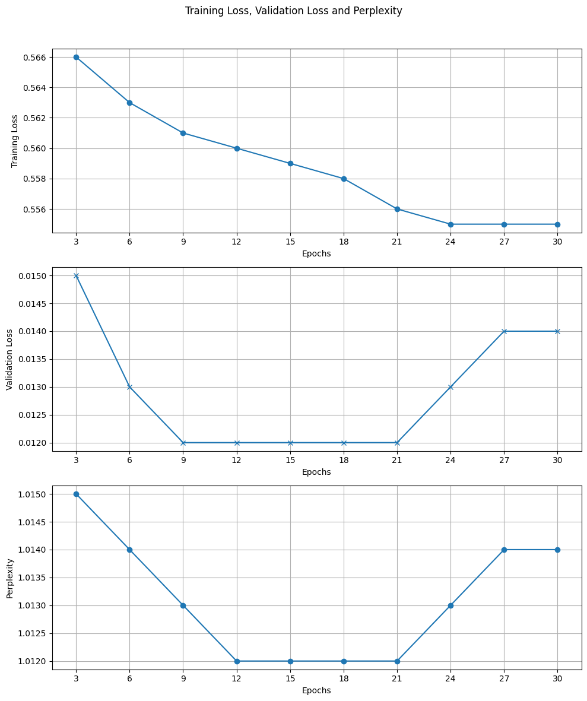

# 📌 Overview
This project explores the architecture, training, and inference of large language models from scratch using PyTorch. It also revisits the LSTM architecture from the pre-transformer era to provide historical and performance-based comparison.

The following model types are implemented and analyzed:

* Encoder-only Transformers (e.g., BERT-style)

* Decoder-only Transformers (e.g., GPT-style)

* Full Seq2Seq Transformers (e.g., for machine translation)

* Baseline RNN model using LSTM

# 📚 Datasets Used
All datasets used in this project are stored in the `data/` folder.
To evaluate and compare various model architectures, the following datasets were employed:

1. Tiny Shakespeare
    - Size: ~1MB of text.
    - Use Case: Useful for quick experimentation with character-level generation due to its small size and stylistic consistency.
    - Applied in: Encoder-only, decoder-only, and LSTM models.

2. Alice in Wonderland by Lewis Carroll
    - Size: ~150KB of text.
    - Use Case: Classic English literature offering structured narrative text, used for experimenting with character-level and word-level tokenizations owing o its small vocabulary size.
    - Applied in: Encoder-only, decoder-only, and LSTM models.

3. IWSLT2017 (EN↔DE Translation)
    - Size: ~40MB of ~200K sentence pairs.
    - Type: Parallel English-German corpus
    - Use Case: Designed for benchmarking machine translation models.
    - Applied in: Seq2Seq Transformer with shared Byte-Pair Encoding (BPE) tokenizer.

# 🧩 Tokenization Strategies
Tokenization plays a crucial role in how language models process and understand text. This project experiments with multiple tokenization schemes to analyze their effect on model performance and generalization.

1. Character-Level Tokenizer
    - Type: Custom, from-scratch implementation -> `utils/ch_tokenizer.py`.
    - Vocabulary: All unique characters from the dataset.
    - Pros: Simple to implement and captures fine-grained detail.
    - Cons: Longer sequences and lower convergence due to sparse signal.

2. Word-Level Tokenizer (Custom)
    - Type: Custom tokenizer splitting on whitespace and punctuation -> `utils/word_tokeinizer.py`
    - Vocabulary: Built manually from training corpus.
    - Pros: More semantic understanding than character-level and faster convergence.
    - Cons: Vocabulary explosion with rare or compound words and poor generalization to unseen words.

3. Byte-Pair Encoding (BPE)
    - Type: Subword-level tokenizer using HuggingFace's tokenizers library.
    - Shared Vocabulary: Trained on combined English-German corpus from IWSLT2017.
    - Training script `scripts/train_tokenizer_seq2seq.py`.
    - Trained tokenizer `tokenizers/seq2seq_shared_tokenizer.json`.
    - Pros: Handles rare words and morphology gracefully, vocabulary size can be tuned and suitable for multilingual tasks.
    - Cons: Slightly more complex setup.

# 📦 Dataset Classes
Custom PyTorch `Dataset` classes were implemented to efficiently handle training samples for different model-tokenizer combinations.

1. `TextDataset` – for Character/Word Tokenizers
    - Used with: Character-level and word-level tokenizers.
    - Purpose: Prepares fixed-length input (x) and target (y) sequences for next-token prediction.
    - Mechanism: For each sample, `x = tokens[i : i+seq_len], y = tokens[i+1 : i+1+seq_len]`
    - Output: (x, y) as integer token sequences.

2. `Seq2SeqDataset` – for BPE-based Translation
    - Used with: BPE tokenizer (`seq2seq_shared_tokenizer.json`)
    - Purpose: Prepares padded input-output sentence pairs for Seq2Seq translation tasks.
    - Mechanism: Tokenizes and pads both `src` and `tgt` sequences and generatesencoder input, decoder input with `[BOS]` and decoder target (right shifted).
    - Output: Dictionary with `src`, `tgt`, and `label` tensors.

# 🧠 LSTM Model (Pre-Transformer Baseline)
The baseline recurrent architecture is implemented in `models/lstm/rnn_LSTM.py`, with training handled via `train_lstm.py` and configurations specified in `config_lstm.py`. Inference or generation from trained checkpoints can be tested using the `generator/lstm_generator.py` script.

Initial experiments were conducted using the Alice in Wonderland dataset with a character-level tokenizer. Without any learning rate scheduling or regularization, signs of overfitting began as early as the first or second epoch. Particularly, when seed prompts were taken directly from the dataset, the generated outputs reproduced the training text almost verbatim. Even when the seed was a random phrase, the generation quickly collapsed into sequences memorized from the dataset, highlighting a severe lack of generalization.

To mitigate this, a lower learning rate and a cosine annealing scheduler were introduced. With this adjusted configuration, the training and validation losses began to diverge only after 7–8 epochs, showing a more realistic training pattern before overfitting set in. A sample loss curve is included in the notebook and visualized below:

The same LSTM model was also tested with a word-level tokenizer trained on the same dataset. Although it showed faster convergence, the generalization issues remained, particularly when the vocabulary was large or rarely occurring tokens were frequent.

  

# 🧠 Encoder-Only Transformer (BERT-style)
This model is based purely on a stack of self-attention-based encoder blocks and is implemented in `models/encoder_only/encoder_only_transformer.py`. The training logic resides in `train_encoder_only.py`, with hyperparameters defined in `config_encoder_only.py`. Generation from trained checkpoints can be tested using `generator/encoder_only_generator.py`.

Unlike LSTM models that process inputs sequentially, encoder-only transformers operate on the entire input sequence in parallel. Each token is embedded and enriched with positional encodings, then passed through multiple layers of multi-head self-attention and feedforward blocks. The attention mechanism allows each token to focus on other relevant tokens in the sequence, enabling the model to learn dependencies and semantic relationships irrespective of their positions. Below is a schematic of the encoder-only transformer architecture. After the stack of encoders one fully connected layer was added to map into the dimension of vocab_size, which finally generates the logits.

  

The self-attention block plays a crucial role here: it helps the model decide "where to look" when processing a token. By splitting into multiple attention heads, the model can learn various types of relationships (e.g., syntactic vs. semantic) simultaneously across different subspaces. These are later merged and passed through residual and feedforward layers to form rich contextual embeddings for each token.

Training behavior was stable and showed no signs of overfitting in early experiments. Around epoch 15 the validation loss was the lowest, then it showed an overfitting tendency. A typical training vs. validation loss curve is shown below. Also shown is the perplexity. Lower the value, more the model is confident towards some specific tokens for prediction.

  

In the earlier layers, attention heads exhibit strong diagonals — a clear indication that the model is primarily attending to each token itself or immediate neighbors. This behavior is expected in early stages, as the model hasn't yet learned meaningful contextual relationships and defaults to identity-like attention for stability. However, in the deeper layers, the attention becomes noticeably more diffuse and asymmetric. The diagonals weaken, and we begin to see off-diagonal activations that reflect the model's growing ability to attend to semantically or syntactically relevant tokens elsewhere in the sequence.

  

The visualized attention heads in Layer 6, for instance, show non-trivial attention to non-adjacent tokens, suggesting the model has learned to selectively emphasize information beyond immediate token neighbors

When it comes to generalization, the encoder-only model outperformed LSTMs. On both datasets (Tiny Shakespeare and Alice in Wonderland), the generated sequences retained the stylistic flavor of the original corpus — such as sentence structure and vocabulary — but without directly copying specific sequences. This contrasts sharply with LSTMs, where outputs often became memorized reproductions of the training text, especially when seeded with familiar phrases. The transformer-based model demonstrated more creative recombination of learned patterns, indicating a better understanding of underlying language semantics rather than simple memorization.
